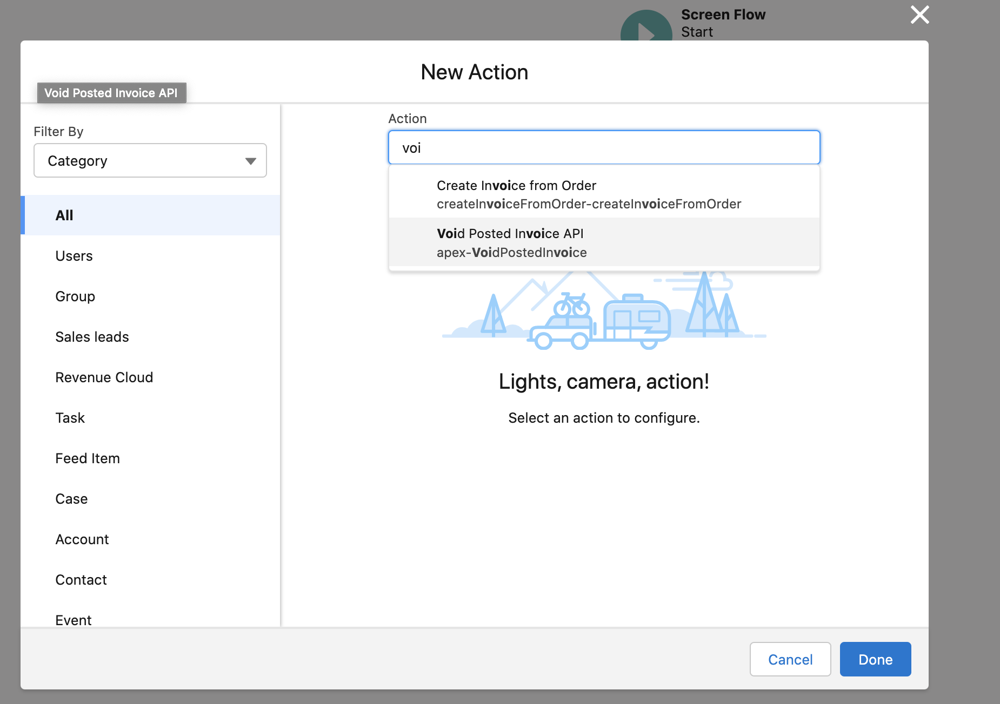
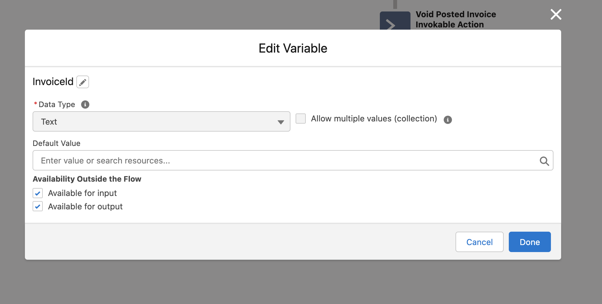
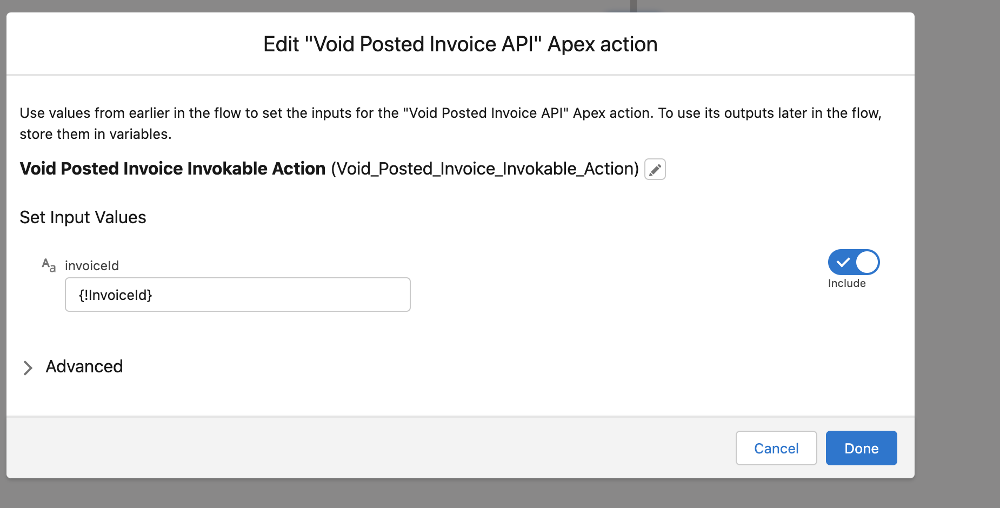
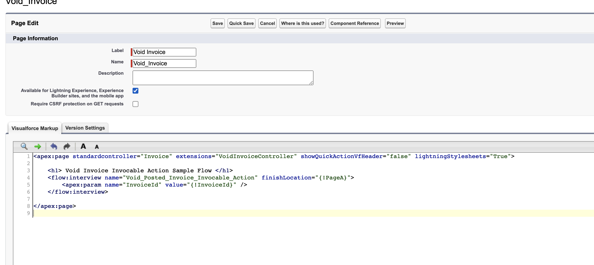
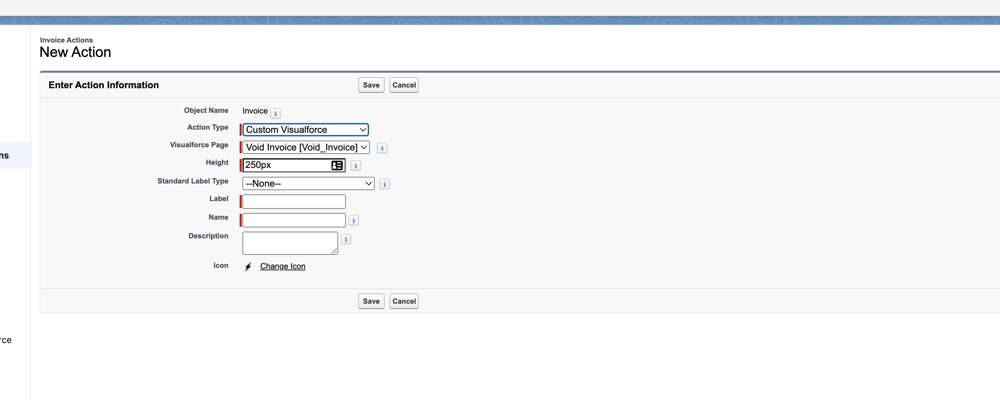
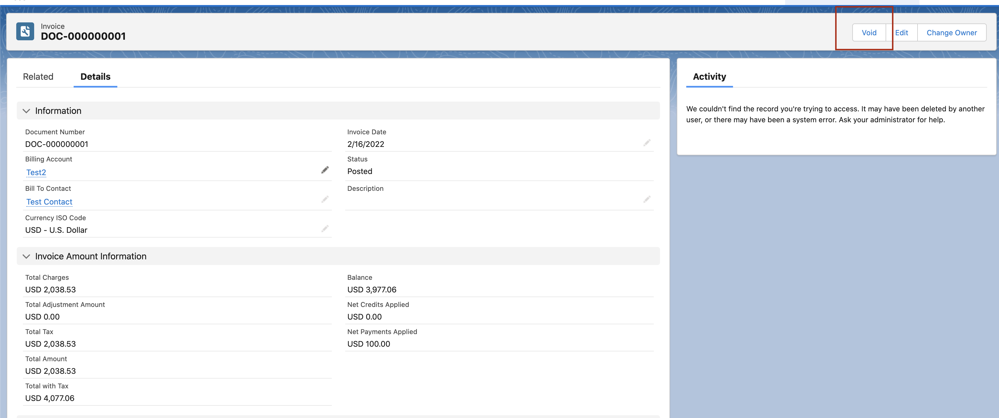

# Void Posted Invoice Invocable Action with UI Action
Void an already posted invoice to correct inaccuracies and return the amount back to the Billing Schedule.

Inaccuracies happen when the upstream data that feeds into the invoice is incorrect. For example, if a product quantity is incorrect, it causes the invoice amount to be incorrect.

This asynchronous API creates a credit memo in the posted state to invalidate the invoice and bring its balance down to 0.0

## Steps to execute

**Step : 1. Create Apex Classes**
1. Go to Setup
2. Search for Apex Classes > Click New
3. Add ErrorResponseRepresentation.apex, ErrorResponseRepresentationList.apex, VoidPostedInvoiceInvocableActionInput.apex, VoidPostedInvoiceInvocableActionOutput.apex and VoidPostedInvoiceApexTest.apex
4. Select "Run All Tests" to ensure VoidPostedInvoiceApexTest.apex runs and the new classes compile successfully.
5. Create VoidInvoiceController.apex class

**Step : 2. Create Screen Flow**
1. Go to Setup
2. Search for Process Automation > Flows. Click on New Flow
3. Select Screen Flow
4. Add element > Action > Void Posted Invoice API as shown in the below image 
5. Create a new resource variable while will be used to pass the invoice ID to the invocable action. Ensure that the Available for Input is checked since this will allow the value to be set from the visualforce page on the Invoice Action as shown in the below image 
6. Configure the action to set the input value to the new resource variable. 
7. Save and activate the flow.

**Step : 3. Create Visualforce page**
1. Go to Setup > Object Manager
2. Search for Visualforce Pages > New
3. Paste contents of VoidInvoiceControllerVF.page as shown in the below image 

**Step : 4. Create Action on Invoice**
1. Go to Setup > Object Manager
2. Search for Invoice
3. Select the Button, Links and Actions option > New Action
4. Populate details as shown in the image 
5. Go the Invoice Page Layout and add the new action and save.
6. Verify the action button is available 
7. Clicking the void button on a Posted Invoice should void that Invoice and create a Credit Memo of an equivalent amount.
